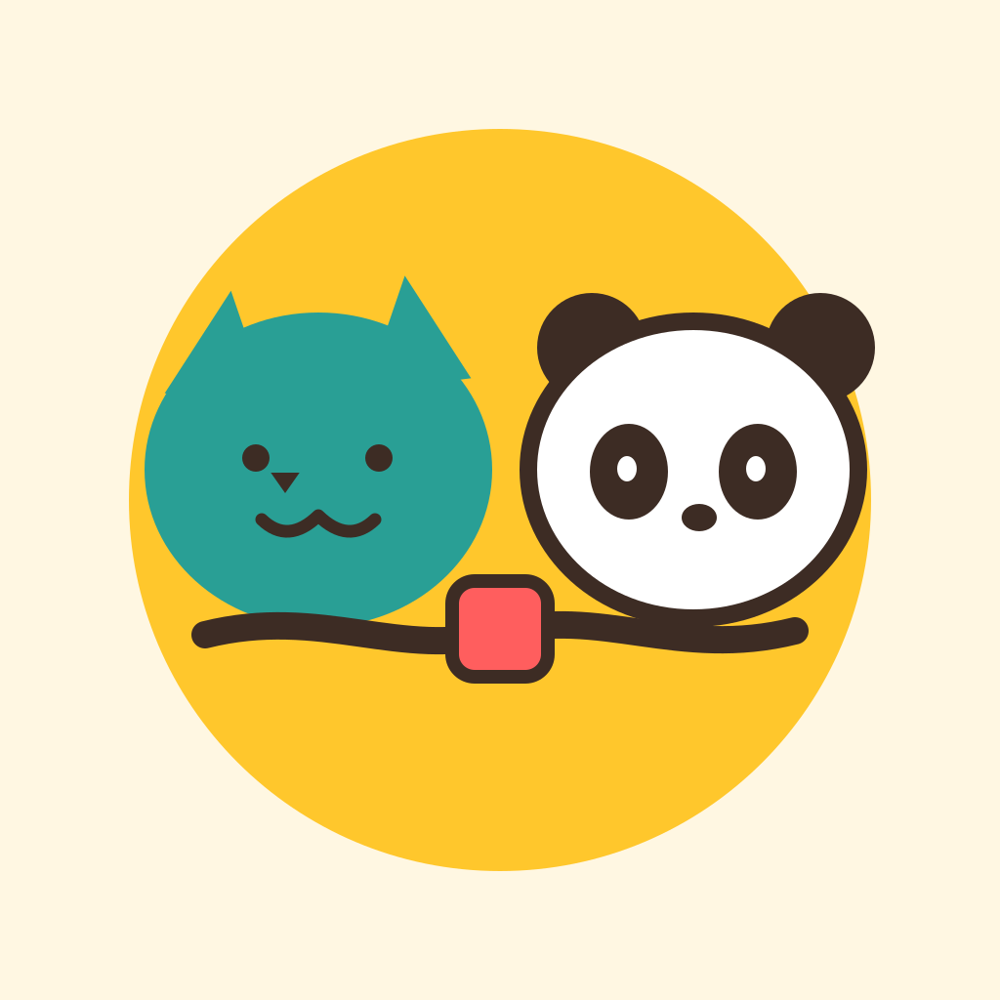

# Tsunahiki 綱引き

  

  <strong>Learn Japanese kana by tugging a rope — one stroke at a time.</strong>

  <em>A handwriting-recognition language game built with Kotlin Multiplatform and Compose Multiplatform.</em>

  
  
  
  
  

---

## 🎮 What is Tsunahiki?

**Tsunahiki** (綱引き, "tug-of-war") is a mobile language-learning game where you write Japanese kana by hand to pull a rope against an opponent. Every correct stroke pulls the flag toward your side. Miss the character, and your opponent drags it back.

You draw each kana on a canvas with your finger. The game compares your strokes against the canonical SVG strokes of the character using **Dynamic Time Warping with point-to-segment distance (DTW_seg)** — the same algorithm used in online handwriting-recognition research. Grades range from **Perfect → Good → Okay → Miss**, and each grade affects the rope's position.

Beat the AI. Level up your kana. Unlock avatars.

---

## ✨ Features

- **Handwriting recognition** — DTW-based stroke similarity, tolerant to timing, speed, and minor shape variation.
- **Guided & Unguided modes** — see animated stroke hints, or test yourself cold.
- **Animated stroke guide** — each kana's strokes draw themselves in order using `PathMeasure` segment interpolation.
- **Progression system** — kana unlocks tied to your language level, tracked per-script (Hiragana / Katakana).
- **XP & levels** — earn XP per match, level up, unlock new kana sets.
- **Coin economy** — win matches to earn coins, spend them on avatars, guides, and cosmetics.
- **In-app purchases** — coin packs backed by RevenueCat, with a Test Store for development.
- **Animated UI** — spring-based buttons, spring text, animated flag physics on the rope.
- **Audio engine** — layered SFX + background music via `SoundPool` and `Media3 ExoPlayer`, with lifecycle-aware pausing.

---

## 🧱 Tech Stack

### Core
| Layer | Technology |
|---|---|
| **Language** | Kotlin 2.4 (Multiplatform) |
| **UI** | Compose Multiplatform |
| **Design system** | Material 3, custom theme with Space Grotesk & Inter |
| **Navigation** | `androidx.navigation.compose` (KMP) with type-safe routes |
| **DI** | Koin (KMP + Android) |
| **Async** | Kotlin Coroutines + Flow |
| **Serialization** | `kotlinx.serialization` (JSON) + `ktoml` (TOML) |

### Platform
| Target | Details |
|---|---|
| **Android** | API 23+, Media3 ExoPlayer, SoundPool, SharedPreferences |
| **iOS** | iOS 13+, static framework `Shared.framework` |
| **File I/O** | Okio `FileSystem` (multiplatform) |
| **Settings** | `multiplatform-settings` (SharedPreferences-backed on Android) |

### Game systems
| System | Implementation |
|---|---|
| **Handwriting similarity** | Custom DTW_seg algorithm (Moussa, Lelore & Mouchère, ICPRAM 2023) |
| **SVG parsing** | Compose `PathParser` → sampled `Offset` lists → normalized strokes |
| **Stroke rendering** | Canvas `Path` + `Stroke(width, cap = Round, join = Round)` |
| **Animations** | `Animatable`, `animateFloatAsState`, spring specs |
| **Particles** | `particle-emitter` (dev.piotrprus) |

### Monetization
| Service | Purpose |
|---|---|
| **RevenueCat** | In-app purchases (coin packs, starter pack) |
| **Test Store** | Mock billing backend for development |

### Build & Tooling
| Tool | Purpose |
|---|---|
| **Gradle** (Kotlin DSL) | Build system |
| **BuildKonfig** | Compile-time config from `local.properties` |
| **Version catalog** | Centralized dependency management (`libs.versions.toml`) |
| **JVM target** | Java 11 |
